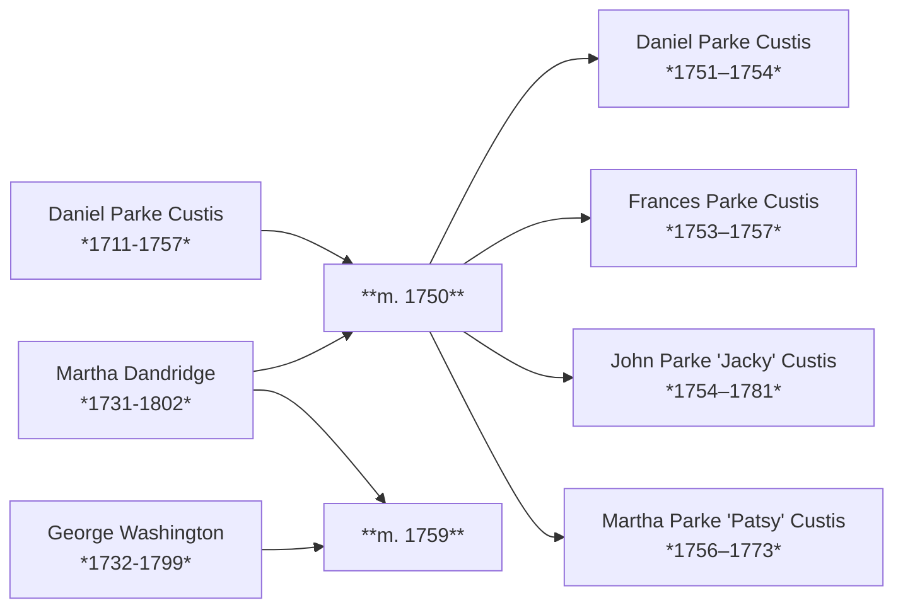

Last names: [[Dandridge]] [[Custis]] [[Washington]]

Marriages of Martha Dandridge: she had four children in her first marriage, none in her second.

```mermaid
flowchart LR
Daniel["Daniel Parke Custis
*1711-1757*"] 

Daniel --> m1["**m. 1750**"]

Martha["Martha Dandridge
*1731-1802*"] 


Martha --> m1

Martha --> m2["**m. 1759**"]
George["George Washington
*1732-1799*"] 

George --> m2

DJr["Daniel Parke Custis
*1751–1754*"]
m1 -->  DJr
Frances["Frances Parke Custis
*1753–1757*"]
m1 --> Frances
Jacky["John Parke 'Jacky' Custis
*1754–1781*"]
m1 --> Jacky
Patsy["Martha Parke 'Patsy' Custis
*1756–1773*"]
m1 --> Patsy


```
